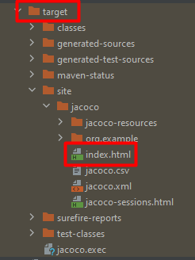
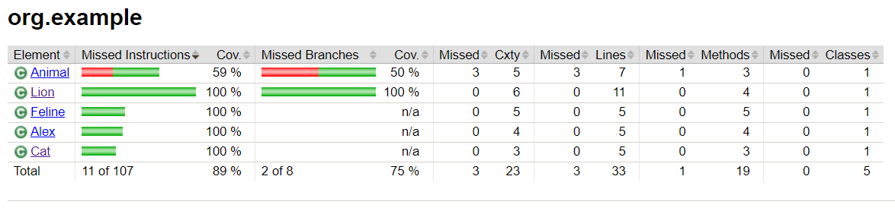
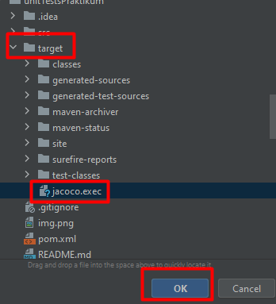
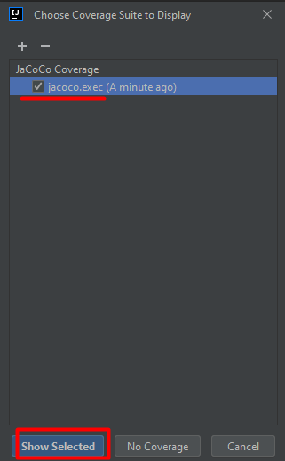
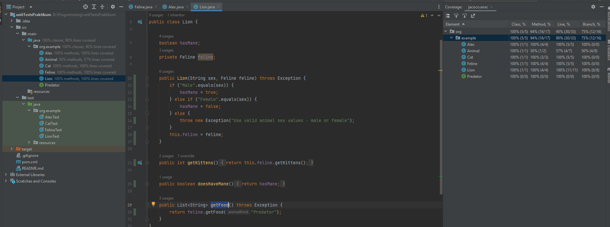

## Unit testing with maven, mockito, parameterized test and jacoco report
***

### Libraries & Tools
> **JDK**: <em>16.0.2</em> 
> **IntelliJ IDEA**: <em>17.0.5</em> 
> **Maven**: <em>3.8.1</em> 
> **JUnit5-Jupiter-Engine**: <em>5.9.2 - Testing Framework</em> 
> **Junit-jupiter-params**: <em>5.9.2 - Parameterized tests enables us to execute a single test method multiple times with different parameters.</em> 
> **Junit-bom**: <em>5.9.2 - is JUnit's Bill Of Materials (BOM). When including this BOM, it will ensure to align and manage all JUnit 5 dependency versions</em> 
> **Mockito**: <em>5.1.1- Framework allows the creation of test double objects (mock objects)</em> 
> **Jacoco**: <em>0.8.7 - Plugin provides code coverage metrics for Jav</em> 
> **Surefire**: <em>3.0.0-M7 -  used during the test phase of the build lifecycle to execute the unit tests of an application.</em>  

### Test scenario
1) Write unit tests for Feline, Cat, Lion, Alex classes
2) Generate the jacoco test coverage report

### Run Tests and Jacoco report

>1) Double click ctrl 
>2) Enter "mvn test" 
>3) Double click ctrl 
>4) Enter "mvn verify" 

**There are two ways to open the jacoco report**

1) The jacoco report in the html page

After that the folder "target" will be created. Find file "index.html".

>target -> site -> index.html

Click the right mouse button

> index.html -> Open In -> Browser -> Chrome

***
2) The jacoco report in the IntelliJ IDEA

>1) CTRL + ALT + F6 
>2) Click to "+" button (Add Insert) 
>3) Choose the file "jacoco.exec" in the "target" package and click to OK

>4) Click to "Show Selected" button

